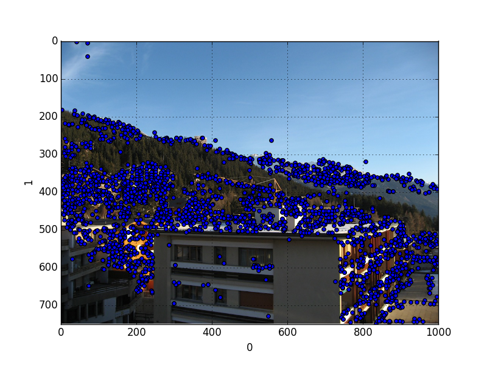
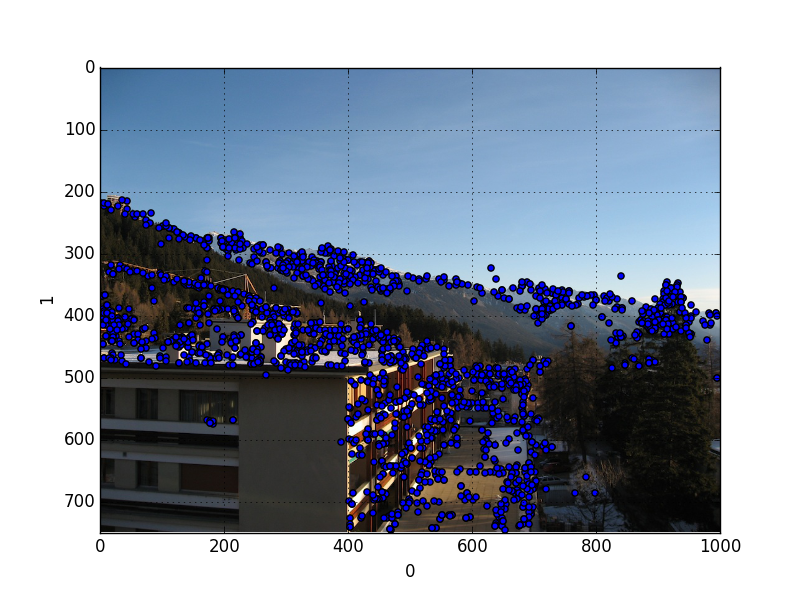
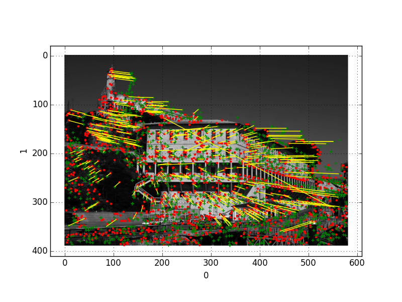

`siftpy1` is based on the 0.8.0 version of SIFT written by Andrea
Vedaldi which is not the latest version anymore, however the new
version by Vedaldi has a lot of extra code and scripting that handled
interfacing to Octave for instance, or Windows portability; we needed
a cleaner C code that would build simply. Another reason for writing
this interface was that another Python interface to the most current
Vedaldi sift, called `pyvlfeat` failed to compile.

This interface is very simple; I hacked through the `sift-driver.cpp`
mainline code. We pass a filename to `pysift1` which is passes on to
Vedaldi's sift that reads it, as though as the command is coming from
the outside. Basically this is a wrapper to command line sift that
works through dynamic libraries, the advantage is no shell execution
is needed. We parse the output automatically as well, and return it as
a Pandas dataframe.

Usage

```python
import siftpy1
df = siftpy1.sift("test.pgm",threshold=10.0)
```

The variable `df` is a Pandas dataframe that carries the SIFT
descriptors; first 4 columns are location / angle, the last 128 are
the descriptors themselves.





Here is Mr. Vedaldi talking about the previous version of this
interface (I updated the link so it points to this one).

http://vision.ucla.edu/~vedaldi/code/siftpp.html

## Matching

```python
from PIL import Image
import pandas as pd
import siftpy1
df1 = siftpy1.sift('alcatraz1s.pgm', threshold=5.0)
df2 = siftpy1.sift('alcatraz2s.pgm', threshold=5.0)
```

```python
matches = siftpy1.match(df1,df2)
print len(matches), len(df1)
print len(matches[matches!=0])
```

```text
1732 1732
371
```

```python
lines = []
for i in df1.index:
      if matches[i] == 0: continue
      tmp1 = (df1.ix[i][0],df1.ix[i][1])
      tmp2 = (df2.ix[matches[i]][0],df2.ix[matches[i]][1])
      lines.append([tmp1,tmp2])
```

```python
f = plt.figure()
ax = f.add_subplot(111)
im = Image.open('alcatraz1s.pgm')
plt.imshow(im,cmap = plt.get_cmap('gray'))
plt.hold(True)
df1.plot(kind='scatter',x=0,y=1,ax=ax,marker='.',color='red')
plt.hold(True)
df2.plot(kind='scatter',x=0,y=1,ax=ax,marker='+',color='green')
plt.hold(True)
from matplotlib import collections  as mc
lc = mc.LineCollection(lines,color='yellow')
ax.add_collection(lc)
plt.savefig('test_03.png')
```

Processing the images below:

[Alcatraz1](alcatraz1s.pgm)

[Alcatraz2](alcatraz2s.pgm)





### Resources

Solem, *Computer Vision with Python*

http://vlfeat.org
